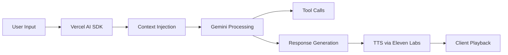
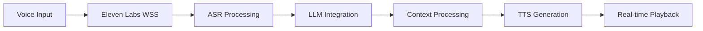

# DM Scenie Feature

## Overview
DM Scenie is a direct messaging interface that allows users to have one-on-one conversations with Scenie, the Space Assistant. This feature provides both text-based chat and voice interaction modes, similar to ChatGPT's interface.

## Implementation Stack

### AI Components
1. **Language Model Integration**
   - Primary: Google's Gemini Pro for tool calls and context processing
   - Streaming responses using Vercel AI SDK for real-time chat interface
   - Function calling capabilities for Space-specific actions

2. **Voice Processing (Eleven Labs Conversational AI)**
   - Complete conversational stack using Eleven Labs' platform
   - Built-in ASR (Automatic Speech Recognition) for accurate transcription
   - Low-latency TTS across 5k+ voices and 31 languages
   - Intelligent turn-taking and interruption detection
   - WebSocket-based real-time communication

### Technical Architecture

#### Frontend Components
```typescript
// Using Vercel AI SDK for chat UI
import { useChat } from 'ai/react'
import { ElevenLabsClient } from '@elevenlabs/node-api'

// Custom hook structure
interface UseScenieChatOptions {
  spaceId: string;
  channelId?: string;
  userId?: string;
  mode: 'text' | 'voice';
}

interface ScenieChatMessage extends ChatMessage {
  contextType?: 'channel' | 'user' | 'space';
  contextId?: string;
}

// Eleven Labs Conversational AI Configuration
interface ElevenLabsConfig {
  agentId: string;
  voiceId: string;
  model: 'eleven_multilingual_v2';
  conversationMode: 'websocket';
  turnTakingConfig: {
    interruptible: boolean;
    maxTurnDuration: number; // 60 seconds
    endpointing: {
      type: 'auto' | 'manual';
    };
  };
}
```

#### Backend Services
1. **Chat Processing Pipeline**
   - Message streaming with Server-Sent Events
   - Context injection for Space/Channel/User data
   - Tool calling middleware for Space actions

2. **Voice Processing Pipeline (Eleven Labs)**
   - WebSocket-based conversation management
   - Built-in speech-to-text processing
   - Automatic turn-taking and conversation flow
   - Real-time voice streaming with minimal latency
   - Dynamic agent responses with context awareness

### Data Flow
1. **Text Chat Mode**


2. **Voice Chat Mode (Eleven Labs)**


## Core Features

### 1. Text Chat Mode
- Traditional back-and-forth chat interface
- Voice dictation for Scenie's responses
- Persistent chat history
- Real-time responses
- Accessible through the DM interface

### 2. Voice Chat Mode
- Synchronous voice-to-voice conversation
- 1-minute maximum duration per interaction
- Real-time voice processing and response
- Push-to-talk interface

## Contextual Understanding
Scenie can discuss and provide insights about:
- Any channel in the Space
  - Historical messages
  - Channel context
  - Recent discussions
- Space members
  - User profiles
  - Message history
  - Activity patterns

## User Interface
- Appears as a standard DM conversation in the interface
- Scenie always shows as "online" and ready to respond
- Seamless switching between text and voice modes
- Visual indicators for voice recording and processing

## Technical Requirements

### API Endpoints Needed
- Message history retrieval by channel
- User profile and message history access
- Voice processing endpoints
- Response generation endpoints

### Data Access
- Channel message history
- User profile information
- Space member activity data
- Voice data processing

## User Experience
1. Users access Scenie through the DM section
2. Can freely switch between text and voice modes
3. Receive contextual responses about Space activities
4. Voice responses are automatically dictated
5. Clear indicators for voice recording limits

## Limitations
- Voice chat limited to 1-minute sessions
- Context window limitations for historical data
- Processing time for voice-to-voice responses

## Future Enhancements
- Expanded context window
- Multiple voice chat modes
- Enhanced user context understanding
- Integration with Space analytics 

## Integration Points

### 1. Space Context Integration
```typescript
interface SpaceContext {
  recentMessages: {
    channelId: string;
    messages: Message[];
    timestamp: Date;
  }[];
  activeUsers: UserProfile[];
  relevantChannels: Channel[];
}
```

### 2. Voice Processing Configuration
```typescript
interface VoiceConfig {
  elevenlabs: {
    apiKey: string;
    organizationId: string;
    agent: {
      id: string;
      name: string;
      voiceId: string;
      model: 'eleven_multilingual_v2';
    };
    conversation: {
      websocket: {
        reconnection: boolean;
        maxRetries: number;
      };
      turnTaking: {
        mode: 'auto' | 'manual';
        maxDuration: number; // 60 seconds
        interruptible: boolean;
        silenceTimeout: number;
      };
    };
  };
}
```

### 3. Tool Calling Structure
```typescript
interface ScenieTool {
  name: string;
  description: string;
  parameters: Record<string, unknown>;
  execute: (params: any) => Promise<any>;
}

const spaceTools: ScenieTool[] = [
  {
    name: 'fetchChannelContext',
    description: 'Retrieve recent messages and context from a channel',
    parameters: {
      channelId: 'string',
      timeframe: 'string'
    }
  },
  // ... other tools
]; 